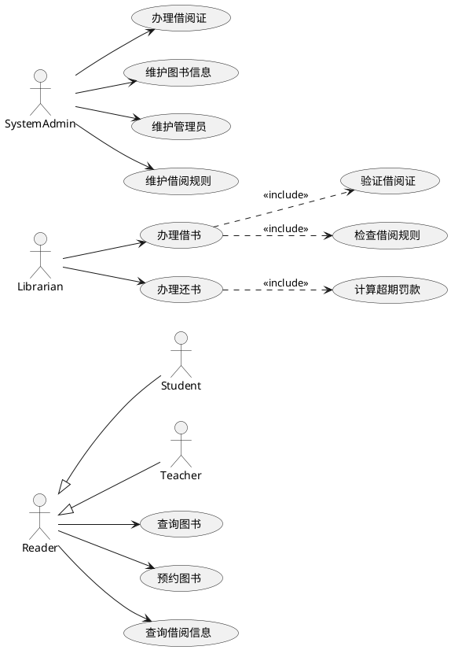

# 实验一：AI时代图书管理系统的架构设计与 Spec 建模

## 一、实验目的

以图书管理系统为例，完成基于 Agent 辅助的需求分析、UML 建模、领域建模、架构设计和数据库初步设计。

通过本实验，学生应掌握：

1. 使用 Agent 辅助进行需求澄清。
2. 使用 OpenSpec 组织软件规格文档。
3. 使用 PlantUML 或 Mermaid 表达 UML 模型。
4. 使用用例驱动方法识别参与者和用例。
5. 建立领域模型和领域类图。
6. 设计分层架构和 MVC 模式。
7. 根据领域模型完成数据库概念设计。
8. 使用人工审查清单修正 Agent 生成内容。

---

## 二、实验内容

本实验围绕图书管理系统展开。

系统主要需求包括：

1. 读者需要注册账号。
2. 系统管理员为读者办理借阅证。
3. 借阅证包含读者姓名、院系或单位、借阅证号。
4. 图书管理员作为代理，帮助读者完成借书、还书和查询借阅信息。
5. 借书时系统需要验证借阅证有效性。
6. 系统需要检查读者是否超过借阅数量。
7. 系统需要检查读者是否存在超期未归还图书。
8. 还书时系统需要验证图书是否为本馆藏书。
9. 系统需要删除或更新相应借阅信息。
10. 系统支持不同读者类型，不同读者类型有不同借阅数量和期限。
11. 系统支持不同借出物类型，不同类型有不同罚款规则。
12. 读者可以通过网络预约和查询。
13. 系统管理员负责系统维护，包括借阅证、管理员、图书、标题信息、规则等。

---

## 三、实验前准备

### 1. 安装工具

推荐至少安装：

```text
Git
CodeBuddy CN / IntelliJ IDEA
PlantUML 插件
Java 17 或 Python 3.10+
CodeBuddy CN/Claude Code / Codex / OpenCode 任一编码 Agent
```

如果使用 PlantUML，还建议安装：

```text
Graphviz
```

验证 PlantUML：

```bash
java -jar plantuml.jar -version
```

或者在 CodeBuddy CN 中安装 PlantUML 插件后直接预览 `.puml` 文件。

---

## 四、创建项目

```bash
mkdir library-management-ai
cd library-management-ai

mkdir specs

touch specs/00-project-brief.md
touch specs/01-clarifying-questions.md
touch specs/02-requirements.md
touch specs/03-use-cases.md
touch specs/04-use-case-model.puml
touch specs/05-domain-model.md
touch specs/06-domain-class-diagram.puml
touch specs/07-architecture.md
touch specs/08-package-diagram.puml
touch specs/09-design-model.md
touch specs/10-sequence-borrow-book.puml
touch specs/11-sequence-return-book.puml
touch specs/12-sequence-reserve-book.puml
touch specs/13-database-design.md
touch specs/14-api-spec.md
touch specs/15-test-plan.md
touch specs/16-tasks.md
touch specs/17-risk-analysis.md
touch specs/18-review-checklist.md
touch specs/19-ai-usage-log.md
touch specs/constitution.md

git init
git add .
git commit -m "init AI-era library management experiment"
```

---

## 五、步骤1：编写 Project Brief

文件：

```text
specs/00-project-brief.md
```

写入：

```markdown
# Project Brief：图书管理系统

## 1. 项目背景

本项目是《软件设计与体系结构》课程实验项目，用于训练需求分析、UML建模、架构设计、数据库设计、详细设计和代码实现能力。

## 2. 项目目标

开发一个图书管理系统，支持读者注册、借阅证管理、图书借阅、图书归还、借阅查询、图书预约、系统维护和超期罚款。

## 3. 目标用户

- 读者
- 学生读者
- 教师读者
- 图书管理员
- 系统管理员

## 4. 主要业务

- 注册账号
- 办理借阅证
- 借阅图书
- 归还图书
- 查询借阅信息
- 预约图书
- 维护图书标题信息
- 维护馆藏副本
- 维护管理员
- 计算超期罚款

## 5. 读者类型

- 本科生
- 研究生
- 博士生
- 专科生
- 教师

不同读者类型具有不同借阅数量和借阅期限。

## 6. 借出物类型

- 中文图书
- 外文图书
- 中文杂志
- 外文杂志
- 论文

不同借出物类型具有不同超期规则和罚款规则。

## 7. 技术要求

- 使用 UML 表达分析和设计结果。
- 使用分层架构和 MVC 模式。
- 使用 Agent 辅助生成规格、UML、设计和代码。
- 所有 Agent 生成内容必须人工审查。
- 最终需要有可以运行的代码和自动化测试。

## 8. 暂不实现

- 支付系统真实扣款
- 图书条码扫描硬件
- 复杂全文检索
- 多校区馆藏调拨
- 微信或统一身份认证登录
```

提交：

```bash
git add specs/00-project-brief.md
git commit -m "add project brief"
```

---

## 六、步骤2：让 Agent 提出澄清问题

启动 Agent：

CodeBuddy CN

或

```bash
claude
```

或：

```bash
codex
```

或：

```bash
opencode
```

输入：

```text
你是资深软件需求分析师和软件架构师。

请阅读 specs/00-project-brief.md。

现在不要生成正式需求文档，只提出澄清问题。

要求：
1. 问题覆盖参与者、用例、业务规则、借阅规则、罚款规则、预约规则、权限、数据、架构、测试和教学复杂度。
2. 问题数量控制在 20 到 30 个。
3. 按类别组织。
4. 写入 specs/01-clarifying-questions.md。
5. 文件末尾预留“人类回答”区域。
6. 不要修改其他文件。
```

---

## 七、步骤3：人类回答澄清问题

学生或小组成员在 `specs/01-clarifying-questions.md` 中回答。

建议明确以下内容：

```text
1. 第一阶段是否需要真实登录认证？
2. 借阅证号如何生成？
3. 每种读者类型的最大借阅数量是多少？
4. 每种读者类型的借阅期限是多少？
5. 每种借出物类型的罚款规则是什么？
6. 预约是否允许多人排队？
7. 借书是否必须由图书管理员操作？
8. 读者能否自己借书？
9. 还书是否需要借阅证？
10. 系统管理员和图书管理员权限如何区分？
```

示例回答：

```markdown
## 人类回答

### Q1：是否需要真实登录认证？

第一阶段不实现复杂登录认证。接口中可通过 user_id、librarian_id、admin_id 表示操作人。

### Q2：借阅证号如何生成？

借阅证号由系统生成，格式为 CARD + 年份 + 6位序号，例如 CARD2024000001。

### Q3：本科生最大借阅数量和期限？

本科生最多借 5 本，借阅期限 30 天。

### Q4：研究生最大借阅数量和期限？

研究生最多借 10 本，借阅期限 60 天。

### Q5：教师最大借阅数量和期限？

教师最多借 20 本，借阅期限 90 天。

### Q6：预约是否允许多人排队？

允许。预约按创建时间排队。

### Q7：借书是否必须由图书管理员操作？

是。借书和还书必须由图书管理员代理完成。
```

提交：

```bash
git add specs/01-clarifying-questions.md
git commit -m "answer clarifying questions"
```

---

## 八、步骤4：生成开发宪法

Prompt：

```text
请根据 specs/00-project-brief.md 和 specs/01-clarifying-questions.md 生成 specs/constitution.md。

要求：
1. 约束 Agent 生成 specs、UML、代码和测试的行为。
2. 强调 UML-as-Spec，所有 UML 图必须使用 PlantUML 或 Mermaid 文本格式。
3. 强调 Agent 生成内容必须人工审查。
4. 强调 Specs baseline 后不得擅自修改。
5. 强调分层架构和 MVC。
6. 强调业务规则不得写在 Controller。
7. 强调权限控制。
8. 强调核心用例必须有自动化测试。
9. 只修改 specs/constitution.md。
```

提交：

```bash
git add specs/constitution.md
git commit -m "add development constitution"
```

---

## 九、步骤5：生成需求规格 requirements.md

Prompt：

```text
请根据以下文件生成 specs/02-requirements.md：

- specs/00-project-brief.md
- specs/01-clarifying-questions.md
- specs/constitution.md

要求：
1. 使用正式需求规格格式。
2. 包含项目目标、参与者、功能需求、非功能需求、业务规则。
3. 功能需求编号为 FR-001、FR-002。
4. 业务规则编号为 BR-001、BR-002。
5. 每个功能需求必须有可验证的验收标准。
6. 不要加入 Project Brief 中明确暂不实现的功能。
7. 如果存在不确定点，写入“待确认问题”。
8. 只修改 specs/02-requirements.md。
```

需求规格必须至少包含：

```text
FR-001 注册读者账号
FR-002 办理借阅证
FR-003 删除借阅证
FR-004 添加图书管理员
FR-005 删除图书管理员
FR-006 添加图书标题信息
FR-007 删除图书标题信息
FR-008 添加馆藏副本
FR-009 删除馆藏副本
FR-010 查询图书
FR-011 借阅图书
FR-012 归还图书
FR-013 查询借阅信息
FR-014 预约图书
FR-015 计算超期罚款
FR-016 维护借阅规则和罚款规则
```

人工审查重点：

```text
1. 是否遗漏借阅证？
2. 是否明确图书管理员代理借书还书？
3. 是否区分系统管理员和图书管理员？
4. 是否明确不同读者类型的借阅规则？
5. 是否明确不同借出物类型的罚款规则？
6. 是否每条需求有验收标准？
```

提交：

```bash
git add specs/02-requirements.md
git commit -m "generate requirements spec"
```

---

## 十、步骤6：生成用例文本 use-cases.md

Prompt：

```text
请根据 specs/02-requirements.md 生成 specs/03-use-cases.md。

要求：
1. 识别所有参与者。
2. 识别所有核心用例。
3. 每个用例包含：
   - 用例编号
   - 用例名称
   - 主要参与者
   - 次要参与者
   - 前置条件
   - 后置条件
   - 基本事件流
   - 备选事件流
   - 异常事件流
   - 关联需求编号
4. 重点详细描述：
   - 办理借书
   - 办理还书
   - 预约图书
   - 办理借阅证
   - 计算超期罚款
5. 只修改 specs/03-use-cases.md。
```

### 用例文本质量要求

以“办理借书”为例，必须体现：

```text
1. 图书管理员输入借阅证号。
2. 系统验证借阅证是否存在且有效。
3. 系统检查读者是否超过借阅数量。
4. 系统检查读者是否存在超期未还图书。
5. 系统显示读者信息。
6. 图书管理员输入图书副本信息。
7. 系统验证图书是否为本馆藏书且可借。
8. 系统创建借阅记录。
9. 系统更新图书副本状态和读者账户。
```

提交：

```bash
git add specs/03-use-cases.md
git commit -m "generate use case texts"
```

---

## 十一、步骤7：生成用例图 use-case-model.puml

Prompt：

```text
请根据 specs/03-use-cases.md 生成 PlantUML 用例图，写入 specs/04-use-case-model.puml。

要求：
1. 使用 @startuml 和 @enduml。
2. 参与者至少包括 Reader、Student、Teacher、Librarian、SystemAdmin。
3. Student 和 Teacher 应泛化自 Reader。
4. 用例至少包括注册账号、查询图书、预约图书、查询借阅信息、办理借书、办理还书、办理借阅证、添加图书、删除图书、维护规则。
5. 准确表达 include、extend 或泛化关系。
6. 不要修改其他文件。
```

PlantUML 示例风格：



提交：

```bash
git add specs/04-use-case-model.puml
git commit -m "generate use case diagram"
```

---

## 十二、步骤8：生成领域模型 domain-model.md

Prompt：

```text
请根据 specs/02-requirements.md 和 specs/03-use-cases.md 生成 specs/05-domain-model.md。

要求：
1. 识别核心领域类。
2. 每个领域类包含：
   - 类名
   - 职责
   - 关键属性
   - 关键方法或行为
   - 约束
   - 与其他类的关系
3. 必须考虑继承或分类关系：
   - Reader
   - StudentReader
   - TeacherReader
   - LibraryItem
   - Book
   - Magazine
   - Thesis
4. 必须包含：
   - BorrowCard
   - Loan
   - Reservation
   - BorrowPolicy
   - FineRule
   - FineRecord
5. 说明哪些类属于实体，哪些属于值对象，哪些属于服务或策略。
6. 只修改 specs/05-domain-model.md。
```

人工审查重点：

```text
1. 领域类是否来自业务，不是数据库表的机械翻译？
2. 是否体现不同读者类型？
3. 是否体现不同借出物类型？
4. 借阅规则是否抽象为 BorrowPolicy？
5. 罚款规则是否抽象为 FineRule？
6. Loan 是否能表达借出和归还状态？
7. Reservation 是否支持排队？
```

提交：

```bash
git add specs/05-domain-model.md
git commit -m "generate domain model"
```

---

## 十三、步骤9：生成领域类图 domain-class-diagram.puml

Prompt：

```text
请根据 specs/05-domain-model.md 生成 PlantUML 领域类图，写入 specs/06-domain-class-diagram.puml。

要求：
1. 使用 @startuml 和 @enduml。
2. 表达类、属性、核心方法。
3. 表达继承、关联、聚合或组合。
4. Reader 与 StudentReader、TeacherReader 的关系要清晰。
5. LibraryItem 与 Book、Magazine、Thesis 的关系要清晰。
6. Reader 与 BorrowCard、Loan、Reservation 的关系要清晰。
7. BorrowPolicy 和 FineRule 的作用要清晰。
8. 不要加入 Controller、Repository、DTO 等设计类。
```

提交：

```bash
git add specs/06-domain-class-diagram.puml
git commit -m "generate domain class diagram"
```

---

## 十四、步骤10：生成架构设计 architecture.md

Prompt：

```text
请根据 specs/02-requirements.md、specs/05-domain-model.md 和 specs/constitution.md 生成 specs/07-architecture.md。

要求：
1. 采用分层架构和 MVC 模式。
2. 至少包含：
   - Presentation Layer / Controller Layer
   - Application Service Layer
   - Domain Layer
   - Infrastructure / Persistence Layer
   - Test Layer
3. 说明每一层职责。
4. 说明主要模块：
   - reader
   - card
   - catalog
   - circulation
   - reservation
   - fine
   - admin
5. 说明权限控制策略。
6. 说明异常处理策略。
7. 说明事务边界。
8. 说明业务规则放在哪些类中。
9. 说明可以使用哪些设计模式。
10. 只修改 specs/07-architecture.md。
```

建议体现的设计模式：

```text
Strategy：不同读者类型的借阅规则、不同借出物类型的罚款规则
Factory：创建不同类型读者或馆藏资源
Repository：持久化领域对象
Service Layer：组织用例流程
DTO：隔离接口层和领域层
MVC：分离界面、控制和模型
```

提交：

```bash
git add specs/07-architecture.md
git commit -m "generate architecture spec"
```

---

## 十五、步骤11：生成包图 package-diagram.puml

Prompt：

```text
请根据 specs/07-architecture.md 生成 PlantUML 包图，写入 specs/08-package-diagram.puml。

要求：
1. 表达分层架构。
2. 表达主要包：
   - presentation
   - application
   - domain
   - infrastructure
   - dto
   - test
3. 表达模块包：
   - reader
   - card
   - catalog
   - circulation
   - reservation
   - fine
   - admin
4. 表达依赖方向。
5. Controller 不得直接依赖 Repository。
6. Infrastructure 可以实现 Repository 接口。
7. 不要修改其他文件。
```

提交：

```bash
git add specs/08-package-diagram.puml
git commit -m "generate package diagram"
```

---

## 十六、步骤12：生成数据库设计 database-design.md

Prompt：

```text
请根据 specs/05-domain-model.md 和 specs/07-architecture.md 生成 specs/13-database-design.md。

要求：
1. 找出需要持久化的领域类。
2. 转换为关系模型。
3. 每张表列出：
   - 表名
   - 字段名
   - 类型
   - 是否为空
   - 主键
   - 外键
   - 唯一约束
   - 默认值
   - 说明
4. 必须包含：
   - readers
   - borrow_cards
   - librarians
   - system_admins
   - book_titles
   - library_items
   - loans
   - reservations
   - borrow_policies
   - fine_rules
   - fine_records
5. 说明索引设计。
6. 说明领域继承到关系数据库的映射策略。
7. 只修改 specs/13-database-design.md。
```

人工审查重点：

```text
1. borrow_card.card_no 是否唯一？
2. library_item.barcode 是否唯一？
3. loans 是否能区分借出、已还、超期？
4. reservations 是否能支持排队？
5. fine_rules 是否能支持不同借出物类型？
6. borrow_policies 是否能支持不同读者类型？
7. 是否存在必要外键？
```

提交：

```bash
git add specs/13-database-design.md
git commit -m "generate database design"
```

---

## 十七、步骤13：生成风险分析和审查清单

Prompt：

```text
请根据当前所有 specs 生成：
- specs/17-risk-analysis.md
- specs/18-review-checklist.md

要求：
1. 风险分析覆盖需求风险、建模风险、架构风险、数据库风险、权限风险、Agent 使用风险。
2. 审查清单覆盖：
   - 需求规格
   - 用例文本
   - 用例图
   - 领域模型
   - 类图
   - 架构设计
   - 包图
   - 数据库设计
3. 每个审查项必须可人工判断。
4. 不要修改其他文件。
```

提交：

```bash
git add specs/17-risk-analysis.md specs/18-review-checklist.md
git commit -m "generate risk analysis and review checklist"
```

---

## 十八、步骤14：人工审查与修订

执行：

```bash
git diff HEAD~10..HEAD
```

学生小组逐项检查：

```text
1. Agent 是否编造了需求？
2. 用例是否覆盖原始实验要求？
3. 用例图关系是否合理？
4. 领域类是否符合业务概念？
5. 是否过早引入 Controller、Repository 到领域类图？
6. 架构是否满足分层和 MVC？
7. 数据库设计是否支持业务规则？
8. 是否遗漏借阅规则和罚款规则？
9. 是否遗漏预约？
10. 是否遗漏系统管理员维护功能？
```

修订 Prompt：

```text
请根据以下人工审查意见修订 specs，不要修改代码：

1. 领域模型中缺少 BorrowPolicy，请补充。
2. 用例文本中“办理借书”缺少检查超期未还图书的步骤，请补充。
3. 数据库设计中 borrow_cards.card_no 未设置唯一约束，请修订。
4. 包图中 Controller 直接依赖 Repository，请改为 Controller 依赖 Application Service。

请说明修改了哪些文件和原因。
```

提交：

```bash
git add specs
git commit -m "revise architecture specs after human review"
```

---

## 十九、步骤15：冻结实验一 Baseline

```bash
git add specs
git commit -m "baseline experiment 1 architecture specs"
git tag experiment1-specs-baseline-v1
```

---

## 二十、实验一提交物

```text
1. 00-project-brief.md
2. 01-clarifying-questions.md
3. 02-requirements.md
4. 03-use-cases.md
5. 04-use-case-model.puml
6. 05-domain-model.md
7. 06-domain-class-diagram.puml
8. 07-architecture.md
9. 08-package-diagram.puml
10. 13-database-design.md
11. 17-risk-analysis.md
12. 18-review-checklist.md
13. 19-ai-usage-log.md
14. Git commit 记录
```


