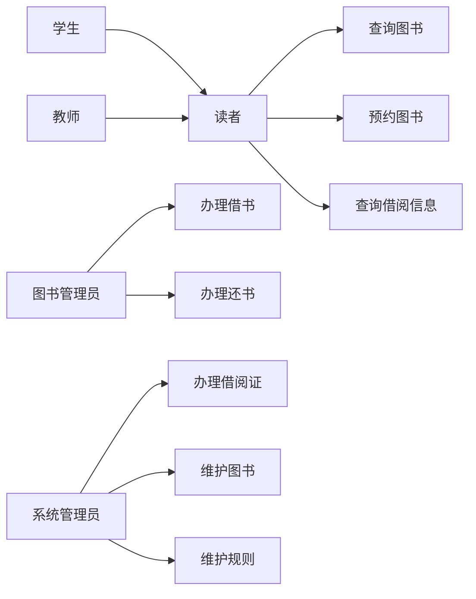
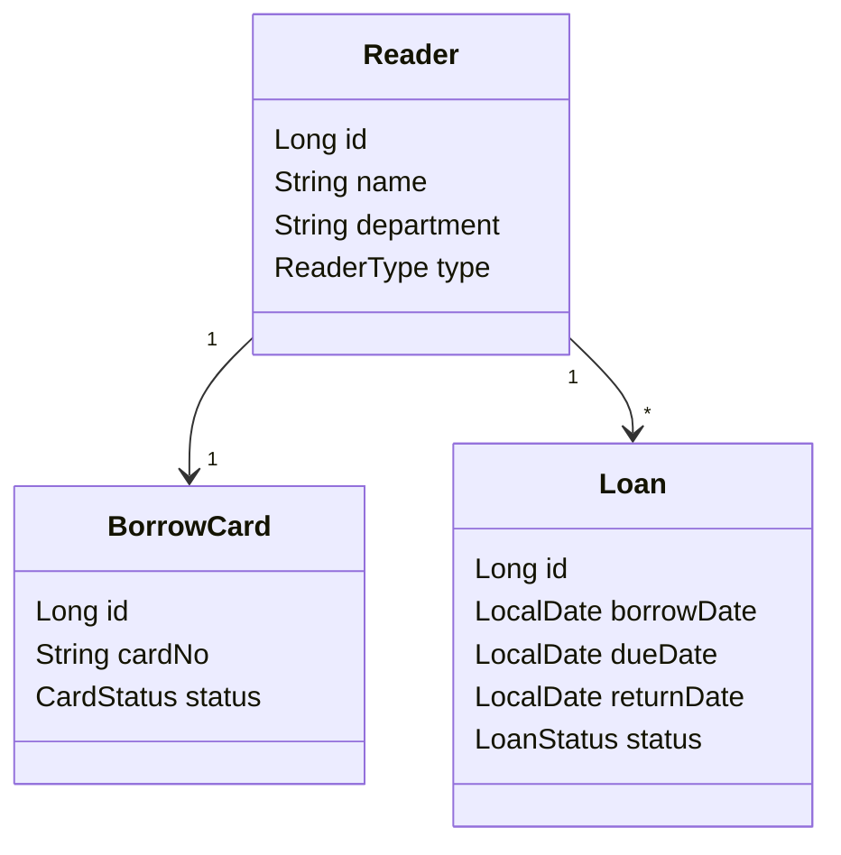
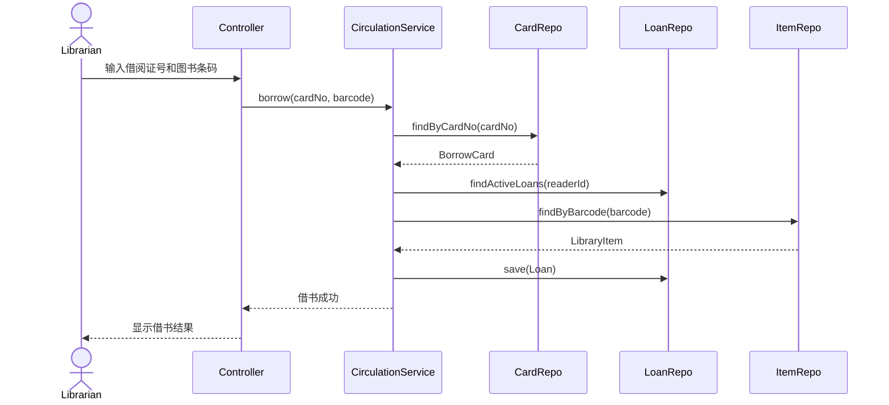
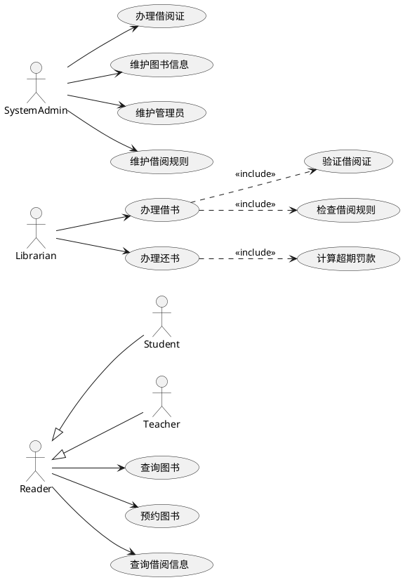
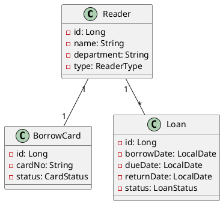

# AI时代软件设计实验工具链使用说明书

## 1. 文档目的

本文档面向《软件设计与体系结构》课程实验，帮助学生配置和使用一套适合 AI 时代软件工程实验的新工具链。

本课程实验需要完成：

- 需求分析；
- 用例建模；
- UML 类图、包图、顺序图；
- 架构设计；
- 数据库设计；
- 详细设计；
- Java 或 Python 代码实现；
- 自动化测试；
- Agent 辅助生成 Specs、UML、代码和测试；
- Git 版本管理；
- 国内大模型 API 接入。

由于学生对 Git、PlantUML、Mermaid、Java、Python、Agent、OpenSpec、Spec-Kit、大模型接入等工具并不熟悉，因此本说明书推荐一套相对容易上手、适合教学组织的工具组合。

---

## 2. 推荐工具组合总览

### 2.1 推荐主线工具组合

| 类别 | 推荐工具 | 推荐理由 |
|---|---|---|
| 编辑器 | VS Code | 轻量、跨平台、插件丰富，适合 Java、Python、Markdown、UML、Agent |
| 版本管理 | Git + Gitee/GitHub | 实验过程可追踪，便于检查 Agent 修改记录 |
| Spec 文档 | Markdown + specs 目录 | 简单、可版本管理、适合 Agent 读取和生成 |
| UML | Mermaid 优先，PlantUML 可选 | Mermaid 上手简单，PlantUML 更接近传统 UML |
| Java | JDK 17 + Maven + Spring Boot | 适合架构课程、分层设计、OO、MVC、设计模式 |
| Python | Python 3.11 + venv/uv + FastAPI | 适合快速实现、接口测试、轻量后端 |
| 数据库 | H2 / SQLite | 免安装数据库服务，适合课程实验，SQLite建议用DB Browser for SQLite操作 |
| Java 测试 | JUnit 5 + MockMvc | Spring Boot 标准测试方式 |
| Python 测试 | pytest + httpx | FastAPI 常用测试组合 |
| Agent 主线 | Cline 或 Roo Code VS Code 插件 | 图形界面友好，适合初学者，支持 OpenAI-compatible 国内模型 |
| Agent 进阶 | OpenCode / Aider | 终端式 Agent，更接近工业工作流 |
| 国内模型 | Qwen Coder / DeepSeek / Kimi / GLM | 国内访问更稳定，成本较低，支持 OpenAI-compatible 接口的服务商较多 |

---

## 3. 为什么这样推荐

### 3.1 不推荐一开始就让所有学生使用 Claude Code 或 Codex

原因：

1. 国外服务访问可能受限；
2. 账号和支付门槛较高；
3. 网络不稳定影响课堂进度；
4. 学生配置成本高；
5. 教师难以统一排查问题。

Claude Code、Codex、OpenCode 等工具可以作为扩展介绍，但不宜作为所有学生的唯一主线工具。

---

### 3.2 推荐 VS Code + Cline/Roo Code 的原因

Cline 和 Roo Code 都是 VS Code 中常用的 Agent 类插件，优点是：

1. 直接在 VS Code 中使用；
2. 能读取当前项目文件；
3. 能修改多个文件；
4. 能执行终端命令；
5. 每次操作可以要求人工确认；
6. 支持 OpenAI-compatible 接口；
7. 可以接入国内模型服务。

对于学生来说，VS Code 插件比纯命令行 Agent 更容易上手。

---

### 3.3 推荐 Mermaid 优先、PlantUML 可选

原实验强调 UML 建模。传统 UML 工具对学生有一定学习成本。

本课程建议：

```text
课堂主线：Mermaid
实验报告或进阶要求：PlantUML
```

原因：

| 工具 | 优点 | 缺点 |
|---|---|---|
| Mermaid | VS Code/Markdown 支持好，语法简单，上手快 | 对复杂 UML 支持不如 PlantUML |
| PlantUML | UML 表达能力强，适合类图、用例图、顺序图 | 需要 Java/插件/Graphviz，配置稍复杂 |

对于课程实验，可以这样要求：

```text
至少使用 Mermaid 或 PlantUML 中的一种；
如果强调标准 UML，推荐 PlantUML；
如果强调降低工具门槛，推荐 Mermaid。
```

---

### 3.4 Java 和 Python 的教学定位

本课程可同时给出 Java 和 Python 两种实现路线，但不建议每个学生都必须同时完成两种。

建议：

```text
Java 作为主线实现；
Python 作为可选实现或对照实现。
```

理由：

- 《软件设计与体系结构》课程更强调分层架构、类、接口、设计模式、MVC；
- Java Spring Boot 更适合体现 Controller、Service、Repository、Entity、DTO；
- Python FastAPI 更适合快速展示接口实现和测试；
- 两种路线都保留，方便不同班级或不同基础的学生选择。

---

## 4. 最小可用工具链

如果希望降低学生压力，推荐最小工具链如下：

```text
VS Code
Git
Java 17
Maven
Spring Boot 项目模板
Mermaid
Cline 或 Roo Code
一个国内大模型 API Key
```

如果学生选择 Python 路线，再安装：

```text
Python 3.11
pytest
FastAPI
SQLAlchemy
```

如果需要正式 UML 图，再安装：

```text
PlantUML 插件
Graphviz
```

---

## 5. 安装 VS Code

### 5.1 下载地址

```text
https://code.visualstudio.com/
```

### 5.2 推荐安装插件

在 VS Code 插件市场搜索并安装：

```text
Chinese (Simplified) Language Pack
GitLens
Markdown All in One
Markdown Preview Mermaid Support
Mermaid Markdown Syntax Highlighting
PlantUML
Extension Pack for Java
Spring Boot Extension Pack
Python
Pylance
Cline 或 Roo Code
```

如果只做 Java：

```text
Extension Pack for Java
Spring Boot Extension Pack
```

如果只做 Python：

```text
Python
Pylance
```

如果只想快速画图：

```text
Markdown Preview Mermaid Support
```

---

## 6. 安装 Git

### 6.1 下载地址

```text
https://git-scm.com/
```

Windows 用户安装 Git for Windows 即可。

### 6.2 验证安装

打开终端：

```bash
git --version
```

应看到类似：

```text
git version 2.x.x
```

### 6.3 配置用户名和邮箱

```bash
git config --global user.name "你的姓名"
git config --global user.email "你的邮箱"
```

查看配置：

```bash
git config --global --list
```

---

## 7. Git 基本使用流程

### 7.1 初始化仓库

```bash
mkdir library-management-ai
cd library-management-ai
git init
```

### 7.2 创建 specs 目录

```bash
mkdir specs
```

### 7.3 提交初始化版本

```bash
git add .
git commit -m "init project"
```

### 7.4 查看状态

```bash
git status
```

### 7.5 查看修改

```bash
git diff
```

### 7.6 提交修改

```bash
git add .
git commit -m "add requirements spec"
```

### 7.7 查看提交历史

```bash
git log --oneline
```

### 7.8 回退某个文件

如果 Agent 修改了不该改的文件：

```bash
git checkout -- specs/02-requirements.md
```

### 7.9 回退所有未提交修改

谨慎使用：

```bash
git reset --hard HEAD
```

---

## 8. 推荐项目目录结构

建议所有学生使用统一结构：

```text
library-management-ai/
  specs/
    00-project-brief.md
    01-clarifying-questions.md
    02-requirements.md
    03-use-cases.md
    04-use-case-model.md
    05-domain-model.md
    06-domain-class-diagram.md
    07-architecture.md
    08-package-diagram.md
    09-design-model.md
    10-sequence-borrow-book.md
    11-sequence-return-book.md
    12-sequence-reserve-book.md
    13-database-design.md
    14-api-spec.md
    15-test-plan.md
    16-tasks.md
    17-risk-analysis.md
    18-review-checklist.md
    19-ai-usage-log.md
    constitution.md
  src/
  tests/
  README.md
```

如果使用 PlantUML，可以将图文件保存为：

```text
04-use-case-model.puml
06-domain-class-diagram.puml
08-package-diagram.puml
10-sequence-borrow-book.puml
```

如果使用 Mermaid，可以直接写在 `.md` 文件中。

---

## 9. OpenSpec 和 Spec-Kit 在本课程中的简化用法

学生不一定需要安装复杂工具。课程中采用“教学版 OpenSpec + Spec-Kit”。

### 9.1 OpenSpec 的含义

在本实验中，OpenSpec 表示：

```text
把需求、用例、领域模型、架构、数据库、API、测试、任务拆解全部写成开放文本格式，
放在 specs 目录中，
由 Git 管理，
由 Agent 读取，
由人类审查。
```

### 9.2 Spec-Kit 的含义

在本实验中，Spec-Kit 表示一组规范文件：

```text
constitution.md
requirements.md
use-cases.md
domain-model.md
architecture.md
database-design.md
api-spec.md
test-plan.md
tasks.md
review-checklist.md
```

### 9.3 为什么不用一开始安装复杂 CLI

原因：

1. 学生工具基础不同；
2. 网络环境不同；
3. 课程重点是软件设计方法，不是工具安装；
4. Markdown + Git + Agent 已经足够支撑实验；
5. 后续熟练后再引入正式 CLI 工具更合适。

---

## 10. Mermaid 使用说明

### 10.1 Mermaid 的优点

Mermaid 可以直接写在 Markdown 文件中，VS Code 可以预览。

### 10.2 用例图示例

在 Markdown 中写：



### 10.3 类图示例



### 10.4 顺序图示例



### 10.5 Mermaid 预览方式

在 VS Code 中打开 Markdown 文件，按：

```text
Ctrl + Shift + V
```

或右键选择：

```text
Open Preview
```

---

## 11. PlantUML 使用说明

### 11.1 什么时候使用 PlantUML

如果课程要求更接近传统 UML，建议使用 PlantUML。

PlantUML 适合：

```text
用例图
类图
包图
顺序图
活动图
状态图
```

### 11.2 安装要求

需要：

```text
Java
VS Code PlantUML 插件
Graphviz
```

Graphviz 下载：

```text
https://graphviz.org/download/
```

### 11.3 验证 Graphviz

```bash
dot -V
```

### 11.4 PlantUML 用例图示例

文件：

```text
specs/04-use-case-model.puml
```

内容：



### 11.5 PlantUML 类图示例



### 11.6 生成图片

如果安装了 PlantUML jar：

```bash
java -jar plantuml.jar specs/04-use-case-model.puml
```

会生成图片文件。

在 VS Code 中通常可以右键预览或导出。

---

## 12. Java 工具链安装

### 12.1 安装 JDK 17

推荐使用：

```text
Eclipse Temurin JDK 17
```

下载地址：

```text
https://adoptium.net/
```

### 12.2 验证 Java

```bash
java -version
```

应看到：

```text
17.x
```

### 12.3 验证 javac

```bash
javac -version
```

### 12.4 安装 Maven

下载地址：

```text
https://maven.apache.org/
```

验证：

```bash
mvn -version
```

### 12.5 创建 Spring Boot 项目

推荐使用 Spring Initializr：

```text
https://start.spring.io/
```

配置：

```text
Project: Maven
Language: Java
Spring Boot: 3.x
Java: 17
Dependencies:
- Spring Web
- Spring Data JPA
- H2 Database
- Validation
- Spring Security Crypto
```

### 12.6 Java 项目推荐结构

```text
src/main/java/com/example/library/
  LibraryApplication.java
  presentation/
  application/
  domain/
    reader/
    card/
    catalog/
    circulation/
    reservation/
    fine/
    admin/
  infrastructure/
  dto/
  exception/

src/test/java/com/example/library/
```

### 12.7 Java 常用命令

运行测试：

```bash
mvn test
```

启动项目：

```bash
mvn spring-boot:run
```

打包：

```bash
mvn package
```

---

## 13. Python 工具链安装

### 13.1 安装 Python 3.11

下载地址：

```text
https://www.python.org/
```

验证：

```bash
python --version
```

或：

```bash
python3 --version
```

### 13.2 创建虚拟环境

Windows：

```bash
python -m venv .venv
.venv\Scripts\activate
```

macOS/Linux：

```bash
python3 -m venv .venv
source .venv/bin/activate
```

### 13.3 安装依赖

创建：

```text
requirements.txt
```

内容：

```txt
fastapi
uvicorn
sqlalchemy
pydantic
pytest
httpx
```

安装：

```bash
pip install -r requirements.txt
```

### 13.4 Python 项目推荐结构

```text
app/
  main.py
  database.py
  routers/
  services/
  domain/
  repositories/
  schemas/
tests/
```

### 13.5 Python 常用命令

启动服务：

```bash
uvicorn app.main:app --reload
```

运行测试：

```bash
pytest
```

---

## 14. 国内大模型推荐

### 14.1 选择原则

本课程需要模型具备：

```text
1. 中文需求分析能力
2. 长文档阅读能力
3. 代码生成能力
4. 多文件修改能力
5. OpenAI-compatible API 接口
6. 国内访问稳定
7. 成本可控
```

### 14.2 推荐模型类型

| 用途 | 推荐模型类型 |
|---|---|
| 需求分析和架构设计 | 通用强模型、长上下文模型 |
| 代码生成 | Coder 模型 |
| 测试生成 | 通用强模型或 Coder 模型 |
| UML 文档生成 | 通用强模型 |
| 大量低成本迭代 | 性价比较高模型 |

### 14.3 可选国内模型

可根据学校条件选择：

```text
Qwen / Qwen Coder
DeepSeek
Kimi
GLM
MiniMax
百度文心
讯飞星火
腾讯混元
火山方舟上的模型
硅基流动上的开源模型
阿里云百炼上的模型
```

建议教师提前统一一种模型服务，避免学生各自配置导致课堂混乱。

---

## 15. 推荐大模型接入方式

### 15.1 推荐使用 OpenAI-compatible API

很多国内模型平台提供类似 OpenAI 的接口格式。

常见配置包含：

```text
API Key
Base URL
Model Name
```

例如：

```text
API Key: sk-xxxx
Base URL: https://api.example.com/v1
Model: qwen-coder-plus
```

不同服务商的 Base URL 和 Model Name 不同，应以服务商控制台为准。

---

## 16. 配置环境变量

### 16.1 不要把 API Key 写入 Git

创建：

```text
.env
```

并加入 `.gitignore`：

```text
.env
```

### 16.2 创建 .env.example

可以提交一个示例文件：

```text
.env.example
```

内容：

```env
OPENAI_API_KEY=your_api_key_here
OPENAI_BASE_URL=https://your-provider-base-url/v1
OPENAI_MODEL=your-model-name
```

### 16.3 Windows PowerShell 设置环境变量

```powershell
$env:OPENAI_API_KEY="你的APIKey"
$env:OPENAI_BASE_URL="https://your-provider-base-url/v1"
$env:OPENAI_MODEL="your-model-name"
```

### 16.4 macOS/Linux 设置环境变量

```bash
export OPENAI_API_KEY="你的APIKey"
export OPENAI_BASE_URL="https://your-provider-base-url/v1"
export OPENAI_MODEL="your-model-name"
```

---

## 17. 推荐 Agent 方案一：VS Code + Cline

### 17.1 为什么推荐 Cline

Cline 适合学生：

1. 直接在 VS Code 中使用；
2. 操作可视化；
3. 可以读取项目文件；
4. 可以编辑文件；
5. 可以执行命令；
6. 支持用户确认；
7. 支持 OpenAI-compatible 模型。

### 17.2 安装 Cline

在 VS Code 插件市场搜索：

```text
Cline
```

安装后，左侧会出现 Cline 图标。

### 17.3 配置国内模型

在 Cline 设置中选择类似：

```text
OpenAI Compatible
```

填写：

```text
Base URL: 国内模型服务商提供的 OpenAI-compatible 地址
API Key: 你的 API Key
Model ID: 模型名称
```

示例：

```text
Base URL: https://api.example.com/v1
API Key: sk-xxxx
Model ID: qwen-coder-plus
```

注意：不同平台的模型名不同，应以平台控制台为准。

### 17.4 Cline 推荐权限设置

建议选择：

```text
文件修改前需要确认
命令执行前需要确认
不要自动批准所有操作
```

这样学生可以学习审查 Agent 的行为。

### 17.5 Cline 第一次使用 Prompt

```text
你是本项目的 AI 软件工程助手。

请先阅读 specs 目录下的所有文档，特别是：
- specs/constitution.md
- specs/00-project-brief.md
- specs/02-requirements.md
- specs/03-use-cases.md
- specs/05-domain-model.md
- specs/07-architecture.md
- specs/15-test-plan.md
- specs/16-tasks.md

请不要修改任何文件。

请完成：
1. 总结项目目标。
2. 总结核心参与者和用例。
3. 总结架构约束。
4. 总结当前任务状态。
5. 给出建议的下一步。
6. 等待我确认后再修改文件。
```

---

## 18. 推荐 Agent 方案二：VS Code + Roo Code

Roo Code 与 Cline 类似，也适合 VS Code 环境。

### 18.1 安装

在 VS Code 插件市场搜索：

```text
Roo Code
```

### 18.2 配置方式

通常选择：

```text
OpenAI Compatible
```

填写：

```text
API Key
Base URL
Model Name
```

### 18.3 使用建议

和 Cline 一样：

```text
不要开启完全自动模式；
每次文件修改和命令执行都要确认；
一次只让 Agent 完成一个任务。
```

---

## 19. 进阶 Agent 方案：Aider

Aider 是一个比较成熟的命令行代码 Agent，适合进阶学生使用。

### 19.1 安装

```bash
pip install aider-chat
```

### 19.2 使用国内 OpenAI-compatible 模型

示例：

```bash
export OPENAI_API_KEY="你的APIKey"
export OPENAI_API_BASE="https://your-provider-base-url/v1"
aider --model openai/your-model-name
```

Windows PowerShell：

```powershell
$env:OPENAI_API_KEY="你的APIKey"
$env:OPENAI_API_BASE="https://your-provider-base-url/v1"
aider --model openai/your-model-name
```

### 19.3 Aider 使用方式

进入项目目录：

```bash
cd library-management-ai
aider --model openai/your-model-name
```

然后输入：

```text
请先阅读 specs/constitution.md 和 specs/16-tasks.md，不要修改文件，先总结任务。
```

### 19.4 Aider 优点

```text
1. 与 Git 配合较好；
2. 修改文件能力强；
3. 适合命令行熟悉的学生；
4. 支持多种模型接入。
```

### 19.5 Aider 风险

```text
1. 命令行对初学者不够友好；
2. 修改文件较快，需要学生看 diff；
3. 配置模型时可能需要调试。
```

---

## 20. 进阶 Agent 方案：OpenCode

OpenCode 是终端式编码 Agent，适合熟悉命令行的学生和教师演示。

### 20.1 安装方式

不同版本安装方式可能变化，请以官方文档为准。

常见方式可能包括：

```bash
npm install -g opencode
```

或使用对应平台的安装脚本。

### 20.2 启动

```bash
cd library-management-ai
opencode
```

### 20.3 配置国内模型

OpenCode 的配置格式可能随版本变化。通常需要配置：

```text
provider
base_url
api_key
model
```

如果支持 OpenAI-compatible，可填写国内模型服务商地址。

示例思路：

```text
Provider: OpenAI Compatible
Base URL: https://your-provider-base-url/v1
API Key: sk-xxxx
Model: your-model-name
```

### 20.4 OpenCode 使用建议

```text
1. 教师可以作为课堂演示工具；
2. 学生可作为进阶选项；
3. 不建议完全自动批准所有修改；
4. 每次任务后必须 git diff。
```

---

## 21. Claude Code 和 Codex 的定位

Claude Code 和 Codex 很强，但在本课程中建议作为“了解和拓展工具”，不作为所有学生统一要求。

原因：

```text
1. 国外账号和访问问题；
2. 网络稳定性问题；
3. 成本问题；
4. 学生配置差异大。
```

如果学生已经具备条件，可以使用。

但实验规范应写成：

```text
可以使用 Claude Code、Codex、OpenCode、Cline、Roo Code、Aider 等任一 Agent；
但必须满足：
1. 能读取项目文件；
2. 能按 specs 工作；
3. 修改前能输出计划；
4. 修改后能运行测试；
5. 人类能审查 diff。
```

---

## 22. 教师推荐统一方案

### 22.1 最推荐课堂统一方案

```text
VS Code
Git
Markdown
Mermaid
Java 17 + Maven + Spring Boot
Cline 或 Roo Code
国内 OpenAI-compatible 模型
```

### 22.2 Python 作为可选路线

```text
Python 3.11
FastAPI
pytest
SQLite
```

### 22.3 PlantUML 作为加分或进阶

```text
PlantUML
Graphviz
```

### 22.4 Aider/OpenCode 作为进阶

```text
Aider
OpenCode
```

---

## 23. 学生第一周建议安装清单

所有学生必须安装：

```text
[ ] VS Code
[ ] Git
[ ] Markdown 插件
[ ] Mermaid 预览插件
[ ] Cline 或 Roo Code
[ ] 国内模型 API Key
```

Java 组安装：

```text
[ ] JDK 17
[ ] Maven
[ ] Java Extension Pack
[ ] Spring Boot Extension Pack
```

Python 组安装：

```text
[ ] Python 3.11
[ ] Python 插件
[ ] pytest
[ ] FastAPI
```

进阶安装：

```text
[ ] PlantUML
[ ] Graphviz
[ ] Aider
[ ] OpenCode
```

---

## 24. 国内模型服务申请流程

不同平台操作略有不同，但大致流程如下：

```text
第 1 步：注册模型服务平台账号
第 2 步：实名认证或开通服务
第 3 步：进入控制台
第 4 步：创建 API Key
第 5 步：查看 OpenAI-compatible Base URL
第 6 步：查看可用模型名称
第 7 步：在 Cline/Roo Code/Aider/OpenCode 中配置
第 8 步：发送测试请求
```

教师建议提前给学生提供统一说明：

```text
本课程统一使用：
Base URL: xxxxx
Model: xxxxx
API Key 获取方式：xxxxx
每组一个 Key 或每人一个 Key
```

---

## 25. 模型选择建议

### 25.1 需求和设计阶段

优先选择：

```text
长上下文能力强
中文理解好
架构设计能力强
```

适合任务：

```text
需求澄清
用例文本
领域模型
架构设计
数据库设计
测试计划
```

### 25.2 编码阶段

优先选择：

```text
Coder 模型
代码能力强
能稳定修改多文件
```

适合任务：

```text
Spring Boot 代码
FastAPI 代码
JUnit 测试
pytest 测试
重构
修复错误
```

### 25.3 低成本迭代阶段

可以使用较便宜模型处理：

```text
格式整理
README 生成
ai-usage-log 整理
简单测试补充
```

---

## 26. Agent 使用基本工作流

每次使用 Agent 都遵循：

```text
Plan → Confirm → Implement → Test → Review → Commit
```

### 26.1 Plan

让 Agent 先读 specs 并输出计划：

```text
请先阅读相关 specs 和当前代码。
请只输出实现计划，不要修改文件。
```

### 26.2 Confirm

学生确认计划：

```text
计划可以，请按计划执行。
```

### 26.3 Implement

Agent 修改代码或文档。

### 26.4 Test

运行测试：

Java：

```bash
mvn test
```

Python：

```bash
pytest
```

### 26.5 Review

人工审查：

```bash
git diff
```

### 26.6 Commit

提交：

```bash
git add .
git commit -m "complete TASK-XXX"
```

---

## 27. Agent 生成 Specs 的标准 Prompt

```text
你是资深软件需求分析师和软件架构师。

请根据以下文件生成 specs/02-requirements.md：
- specs/00-project-brief.md
- specs/01-clarifying-questions.md
- specs/constitution.md

要求：
1. 只修改 specs/02-requirements.md。
2. 不要修改其他文件。
3. 每个功能需求编号为 FR-001、FR-002。
4. 每个功能需求必须有验收标准。
5. 不要加入 Project Brief 中明确不实现的功能。
6. 如果存在不确定点，写入“待确认问题”。
```

---

## 28. Agent 生成 UML 的标准 Prompt

### 28.1 Mermaid 版本

```text
请根据 specs/03-use-cases.md 生成 Mermaid 用例图，写入 specs/04-use-case-model.md。

要求：
1. 使用 Mermaid 语法。
2. 包含 Reader、Student、Teacher、Librarian、SystemAdmin。
3. 表达核心用例。
4. 如果 Mermaid 不支持标准 UML 关系，请用清晰的节点和箭头表达。
5. 不要修改其他文件。
```

### 28.2 PlantUML 版本

```text
请根据 specs/03-use-cases.md 生成 PlantUML 用例图，写入 specs/04-use-case-model.puml。

要求：
1. 使用 @startuml 和 @enduml。
2. 包含参与者、用例、include、extend、泛化关系。
3. 不要修改其他文件。
```

---

## 29. Agent 编码标准 Prompt

```text
请根据 specs/16-tasks.md 中的 TASK-XXX 实现本任务。

在开始前请阅读：
- specs/constitution.md
- specs/03-use-cases.md
- specs/05-domain-model.md
- specs/07-architecture.md
- specs/09-design-model.md
- specs/13-database-design.md
- specs/15-test-plan.md

要求：
1. 先输出实现计划，不要修改文件。
2. specs 已 baseline，不得修改 specs。
3. 只允许修改 TASK-XXX 指定的文件。
4. 不要大规模重构无关代码。
5. 实现后运行测试。
6. 测试失败时先解释原因，再做最小修复。
```

---

## 30. Agent 使用安全规则

### 30.1 不要把 API Key 发给 Agent

不要在 Prompt 中直接写：

```text
我的 API Key 是 sk-xxxx
```

### 30.2 不要提交 .env

`.gitignore` 中必须有：

```text
.env
```

### 30.3 不要让 Agent 自动修改所有文件

每次任务要限制范围：

```text
本任务只允许修改：
- src/main/java/.../CirculationService.java
- src/test/java/.../CirculationServiceTest.java

不得修改：
- specs/
- README.md
- unrelated modules
```

### 30.4 不要让 Agent 自己修改需求来适配代码

错误方式：

```text
测试失败了，你自己调整 specs 和代码。
```

正确方式：

```text
测试失败后先说明原因。
如果发现 specs 和代码冲突，请先提出变更影响分析，不要直接修改 specs。
```

---

## 31. Java 路线完整配置示例

### 31.1 创建项目

使用 Spring Initializr 创建项目后，进入目录：

```bash
cd library-management-java
git init
mkdir specs
```

### 31.2 application.yml 示例

```yaml
spring:
  datasource:
    url: jdbc:h2:mem:library_db
    driver-class-name: org.h2.Driver
    username: sa
    password:

  h2:
    console:
      enabled: true

  jpa:
    hibernate:
      ddl-auto: update
    show-sql: true

server:
  port: 8080
```

### 31.3 常用命令

```bash
mvn test
mvn spring-boot:run
```

### 31.4 访问 H2

```text
http://localhost:8080/h2-console
```

JDBC URL：

```text
jdbc:h2:mem:library_db
```

---

## 32. Python 路线完整配置示例

### 32.1 创建项目

```bash
mkdir library-management-python
cd library-management-python

mkdir specs app tests
mkdir app/routers app/services app/domain app/repositories app/schemas

touch app/main.py
touch app/database.py
touch requirements.txt
```

### 32.2 requirements.txt

```txt
fastapi
uvicorn
sqlalchemy
pydantic
pytest
httpx
```

### 32.3 安装依赖

```bash
python -m venv .venv
```

Windows：

```bash
.venv\Scripts\activate
```

macOS/Linux：

```bash
source .venv/bin/activate
```

安装：

```bash
pip install -r requirements.txt
```

### 32.4 启动

```bash
uvicorn app.main:app --reload
```

### 32.5 测试

```bash
pytest
```

---

## 33. 课堂组织建议

### 33.1 第一周：工具安装和最小验证

目标：

```text
1. Git 可用
2. VS Code 可用
3. Mermaid 可预览
4. Java 或 Python 项目可启动
5. Agent 可读取项目
6. 国内模型 API 可调用
```

### 33.2 第二周：Agent 辅助生成 Specs

目标：

```text
1. 生成 Project Brief
2. 生成澄清问题
3. 生成人类回答
4. 生成 requirements
5. 生成 use-cases
6. 生成 UML
7. 生成 architecture
```

### 33.3 第三周：详细设计和数据库设计

目标：

```text
1. 生成 design-model
2. 生成 sequence diagrams
3. 生成 database-design
4. 生成 api-spec
5. 生成 test-plan
6. 生成 tasks
```

### 33.4 第四周：Agent 编码和测试

目标：

```text
1. 初始化代码
2. 实现领域实体
3. 实现借阅规则
4. 实现罚款规则
5. 实现借书、还书、预约
6. 自动化测试通过
```

---

## 34. 教师实验环境统一建议

为了减少问题，教师可以提前准备：

```text
1. 一个 Java Spring Boot 模板仓库
2. 一个 Python FastAPI 模板仓库
3. 一个 specs 空模板仓库
4. 一个 Mermaid 示例文件
5. 一个 PlantUML 示例文件
6. 一份 Cline/Roo Code 配置截图
7. 一个国内模型 API Key 申请说明
8. 一份常见错误排查清单
```

---

## 35. 常见问题排查

### 35.1 VS Code 预览不了 Mermaid

解决：

```text
1. 安装 Markdown Preview Mermaid Support 插件。
2. 重新打开 VS Code。
3. 使用 Ctrl + Shift + V 预览。
```

### 35.2 PlantUML 不能生成图

检查：

```bash
java -version
dot -V
```

可能原因：

```text
1. 没装 Java。
2. 没装 Graphviz。
3. Graphviz 没加入 PATH。
4. VS Code PlantUML 插件配置错误。
```

### 35.3 Maven 命令不可用

检查：

```bash
mvn -version
```

可能原因：

```text
1. Maven 未安装。
2. 环境变量未配置。
3. 终端未重启。
```

### 35.4 Python 虚拟环境未生效

检查：

```bash
which python
```

或 Windows：

```bash
where python
```

确认是否指向 `.venv`。

### 35.5 Agent 无法调用模型

检查：

```text
1. API Key 是否正确。
2. Base URL 是否正确。
3. Model Name 是否正确。
4. 是否有余额。
5. 是否选择 OpenAI-compatible 模式。
6. 网络是否能访问服务商。
```

### 35.6 Agent 修改了不该修改的 specs

处理：

```bash
git diff
git checkout -- specs/被修改文件.md
```

然后重新提示 Agent：

```text
你刚才修改了 baseline specs，这是不允许的。
请只修改任务指定的代码文件。
```

### 35.7 Agent 生成的代码测试失败

不要直接让 Agent 全部重写。

正确 Prompt：

```text
测试失败了。
请先分析失败原因。
只做最小修改。
不要重构无关代码。
不要修改 specs。
```

---

## 36. 推荐课堂统一要求

学生最终必须做到：

```text
1. 使用 Git 管理项目。
2. 所有 specs 放在 specs 目录。
3. 至少使用 Mermaid 或 PlantUML 生成 UML。
4. 至少使用一次 Agent 生成需求或 UML。
5. 至少使用一次 Agent 辅助编码。
6. Agent 修改后必须有 git diff 审查记录。
7. API Key 不得提交到仓库。
8. Java 或 Python 二选一完成实现。
9. 自动化测试必须通过。
10. ai-usage-log.md 必须完整。
```

---

## 37. 建议学生优先掌握的命令

### Git

```bash
git status
git diff
git add .
git commit -m "message"
git log --oneline
```

### Java

```bash
mvn test
mvn spring-boot:run
```

### Python

```bash
python -m venv .venv
pip install -r requirements.txt
pytest
uvicorn app.main:app --reload
```

### PlantUML

```bash
java -jar plantuml.jar specs/xxx.puml
```

---

## 38. 推荐最终工具组合结论

对于大多数学生，推荐：

```text
VS Code
Git
Markdown
Mermaid
Cline 或 Roo Code
国内 OpenAI-compatible 模型
Java 17 + Spring Boot
H2
JUnit
```

可选增强：

```text
PlantUML
Graphviz
Python FastAPI
Aider
OpenCode
```

不建议一开始强制所有学生使用：

```text
Claude Code
Codex
复杂 Kubernetes/Docker
真实 MySQL 运维
完整 OAuth/JWT
复杂前端框架
```

---

## 39. 一句话总结

本课程工具链的核心不是追求工具越多越好，而是建立一条学生能真正跑通的 AI 原生软件工程流程：

```text
Markdown 写 Specs
Mermaid/PlantUML 表达 UML
Git 管理变化
Agent 辅助生成
人类审查确认
Java/Python 实现
测试验证结果
```

最重要的是：

```text
工具为软件设计服务，
Agent 为 Specs 服务，
Specs 为实现和测试服务。
```
